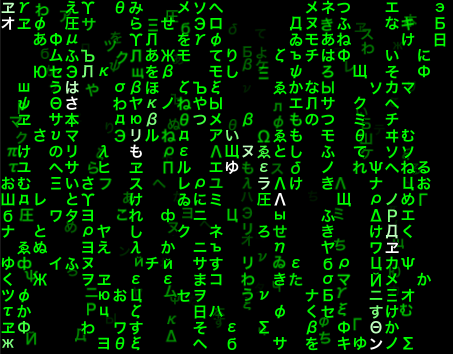
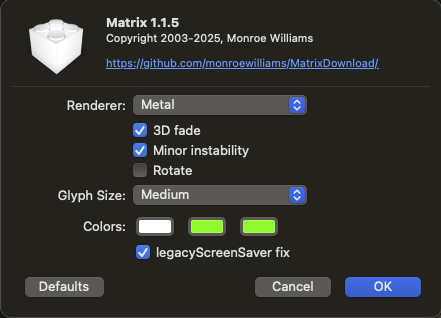

# Matrix

This is a Mac screensaver that I've been tinkering with since roughly 2002. I run it on all my personal machines, and have given copies to a few friends over the years, but hadn't made it publicly available for download.

After making some updates to it recently, I decided it was time.

 

Download the latest release [here](https://github.com/monroewilliams/MatrixDownload/releases/download/1.1.0/Matrix.saver.zip).

Unzip to Matrix.saver and double-click it to install, then go to System Preferences -> Desktop & Screen Saver and pick it from the list. 

The "Metal" button switches betewen using OpenGL and Metal for rendering. The others are all pretty self-explanatory, although you might have to wait a bit to see what "Minor Instability" does. :)

